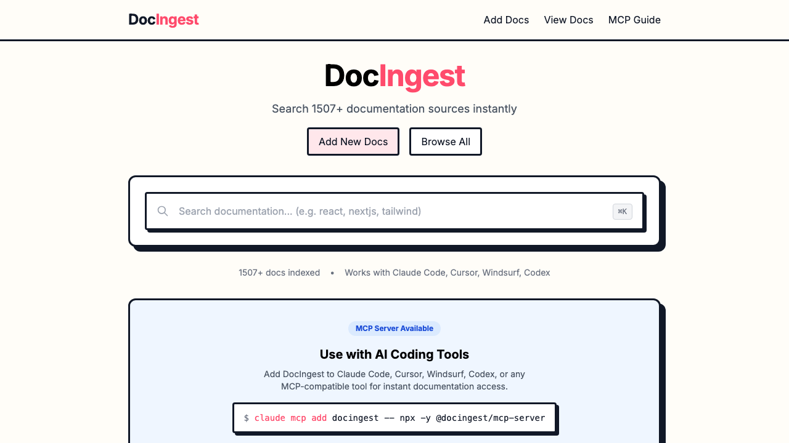
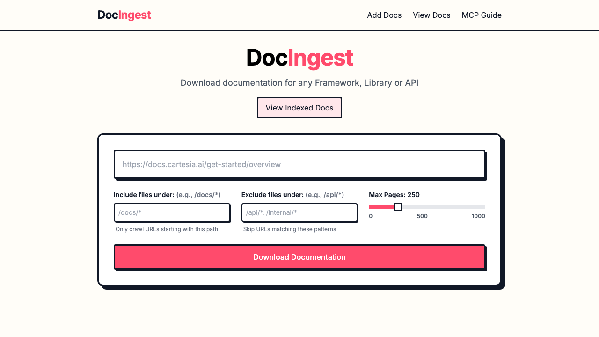

# DocIngest

DocIngest is the [open-source](https://github.com/Amal-David/docingest) engine for turning documentation sites into searchable, MCP-accessible context for humans and coding agents.

It crawls docs, stores them as clean markdown, indexes them for search, and exposes the same corpus through a web UI, CLI, and MCP server. Use it to build a public docs index, self-host an internal corpus, or give coding agents fresher documentation context.

[Quick Start](#quick-start) • [MCP + CLI](#mcp--cli) • [Screenshots](#screenshots) • [Setup Docs](#setup-docs) • [Contributing](#contributing)

## Status

### What works today

- ✅ Index documentation sites from the web UI
- ✅ Browse and search indexed docs at `docingest.com`
- ✅ Open docs by domain, copy markdown, and download stored docs
- ✅ Re-index sources when upstream docs change
- ✅ Query docs from MCP-compatible coding tools
- ✅ Use the package as a lightweight CLI for quick lookup

### Hosted corpus

- 📚 The live `main` deployment currently serves **1,512 latest documentation sites** on `docingest.com` as of April 24, 2026
- 🗂️ DocIngest stores versioned snapshots per domain, so one docs site can have multiple historical versions behind the scenes
- ℹ️ The Git repository does not commit the full hosted corpus; the deployed service holds the actual indexed docs data

### Still early

- 🧪 Search/ranking works, but needs deeper tuning
- 🧪 Loading, empty, and success states need more polish
- 🧪 Version-aware storage exists, but the product UX around versions is still early
- ❌ Not yet a mature enterprise docs platform with permissions, collaboration, and admin workflows

## Screenshots

### Homepage



### Index a docs site



### MCP setup guide


## Quick Start

### Prerequisites

- Node.js 18+ or Bun
- Firecrawl, hosted or self-hosted
- Redis for fast autocomplete/search

Redis is optional for tiny local tests, but recommended for anything serious.

### Install

```bash
git clone https://github.com/Amal-David/docingest.git
cd docingest
npm install
cd server && npm install && cd ..
```

### Configure

Copy `.env.example` to `.env` in the repo root and fill it in. Firecrawl is the default crawl provider, so `CRAWL_PROVIDER` is optional when using Firecrawl:

```bash
CRAWL_PROVIDER=firecrawl
FIRECRAWL_API_KEY=fc-your-api-key-here
FIRECRAWL_API_URL=https://api.firecrawl.dev/v1
REACT_APP_API_URL=http://localhost:8001/api
REDIS_HOST=localhost
REDIS_PORT=6380
```

For local Docker with self-hosted Firecrawl:

```bash
CRAWL_PROVIDER=firecrawl
FIRECRAWL_API_URL=http://localhost:3002/v1
REACT_APP_API_URL=http://localhost:8001/api
REDIS_HOST=localhost
REDIS_PORT=6380
```

For setup details, use these guides:

- [Docker run modes](./docs/setup/docker.md)
- [Firecrawl setup](./docs/setup/firecrawl.md)
- [Redis setup](./docs/setup/redis.md)

### Run

Choose the local services you want:

Run everything local:

```bash
docker compose --profile firecrawl --profile tools up -d
```

Run only Redis:

```bash
docker compose up -d redis
```

Run Redis and Firecrawl without the Redis UI:

```bash
docker compose --profile firecrawl up -d
```

Run Redis with the Redis UI:

```bash
docker compose --profile tools up -d
```

Run the app locally:

```bash
npm run dev
```

If port `8001` is already busy, use the alternate local API port:

```bash
npm run dev:local
```

Then open `http://localhost:8000`.

After indexing docs, build the Redis search index:

```bash
cd server
npm run build-index
```

## MCP + CLI

Add DocIngest to Claude Code:

```bash
claude mcp add docingest -- npx -y @docingest/mcp-server
```

Use the same package as a CLI:

```bash
npx @docingest/mcp-server find react
npx @docingest/mcp-server read react.dev --topic hooks --max-tokens 5000
npx @docingest/mcp-server search "server components" --limit 5
```

MCP tools:

- `find-docs` finds a library or docs domain
- `read-docs` fetches focused documentation content
- `query-docs` searches across indexed docs

For editor-specific config, see [the MCP server README](./mcp-server/README.md).

## Setup Docs

Use these when you need more than the happy path:

- [Redis setup](./docs/setup/redis.md) for local/self-hosted Redis, indexing, and verification
- [Firecrawl setup](./docs/setup/firecrawl.md) for hosted or self-hosted crawling
- [Docker run modes](./docs/setup/docker.md) for all-in-one or partial local services
- [Nginx setup](./docs/setup/nginx.md) for production reverse proxy configuration
- [Performance notes](./docs/performance.md) for speedups and next optimization work
- [Reference](./docs/reference.md) for storage, API, deployment shape, and repo details

## Tech Stack

- React + TypeScript + Tailwind CSS
- Node.js + Express + TypeScript
- Firecrawl for crawling
- Redis for autocomplete, full-text search, and cached docs
- File-based markdown storage

## Contributing

Contributions are welcome, especially around crawling quality, search/ranking, MCP ergonomics, docs UX, and self-hosting.

- [Issues](https://github.com/Amal-David/docingest/issues)
- [Discussions](https://github.com/Amal-David/docingest/discussions)

## License

MIT
